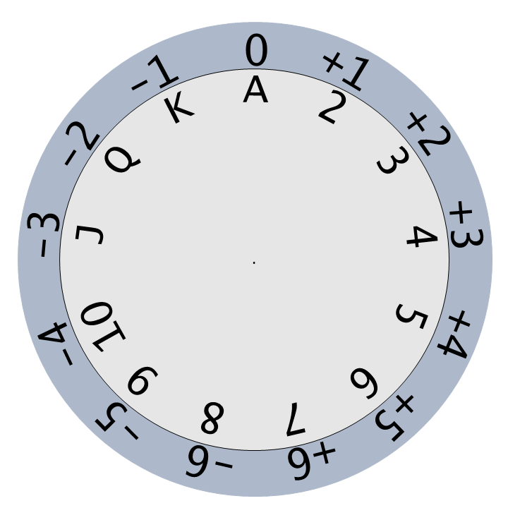

# TC/DR Lookup Tool

By printing the 'Circular' images the in 
[this directory](https://github.com/DeckofAdventures/TheGame/tree/main/docs/src/1_Mechanics/Visual_Tools)
, you can make your own DR lookup tool. Simply cut around the circles of both the back
  and inner images and poke a pin through the center. By spinning the inner plate to
  position the TC at 0, you'll have the upper and lower limits for any DR.

For a spreadsheet version of the same tool, see [this link](https://docs.google.com/spreadsheets/d/1diVpp0g3hydUSgXpEy2Snby42OAUWhZ9lvJsiKR71vM/edit?usp=sharing).

# Range References

Some powers will refer to an area of effect as either a line, aura, or cone. This is
sometimes followed by a number to indicate the size. These are fully defined in the 
[GM Guide](../02_GMGuide.md#moving-in-space). 'Range' images in 
[this directory](https://github.com/DeckofAdventures/TheGame/tree/main/docs/src/1_Mechanics/Visual_Tools) 
show what this would look like on either a grid or hex map. These show Aura 1, Aura 2, Cone 3 and Line 6.
