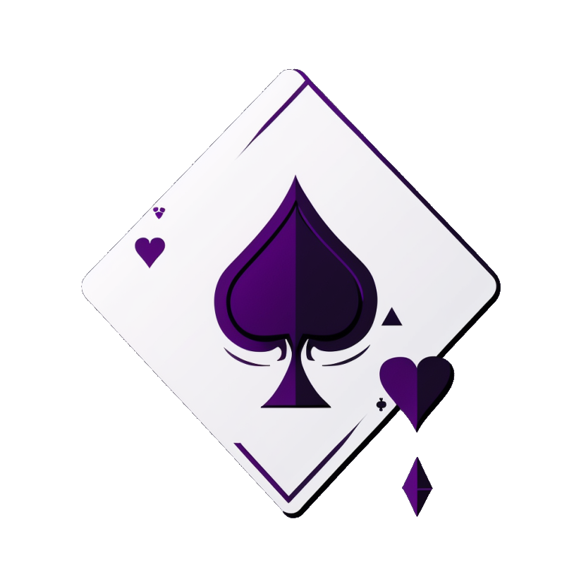

---
hide:
  - feedback
---

# Welcome to Deck of Adventures, The Game

This website establishes latest rules for the Deck of Adventures tabletop
roleplaying game, where there's an adventure in every card.

Deck of Adventures is a collaborative roleplaying system, built with an open source
ethos. You can view the [Quickstart Guide](1_Mechanics/01_PlayerGuide_Brief.md), or read our [Full Player's Guide](1_Mechanics/01_PlayerGuide_Full.md) to learn how to play.

If you'd like to learn more about this project and how to contribute, you can read our [Development Guide](2_Development/01_Community.md).

## Join our [Discord server](https://discord.gg/dk6RfWgPHF)!

*If the above link is expired, please
[submit an issue](https://github.com/DeckofAdventures/TheGame/issues/new?assignees=&labels=bug&template=bug_report.md&title=Expired%20Discord%20Link!).*
